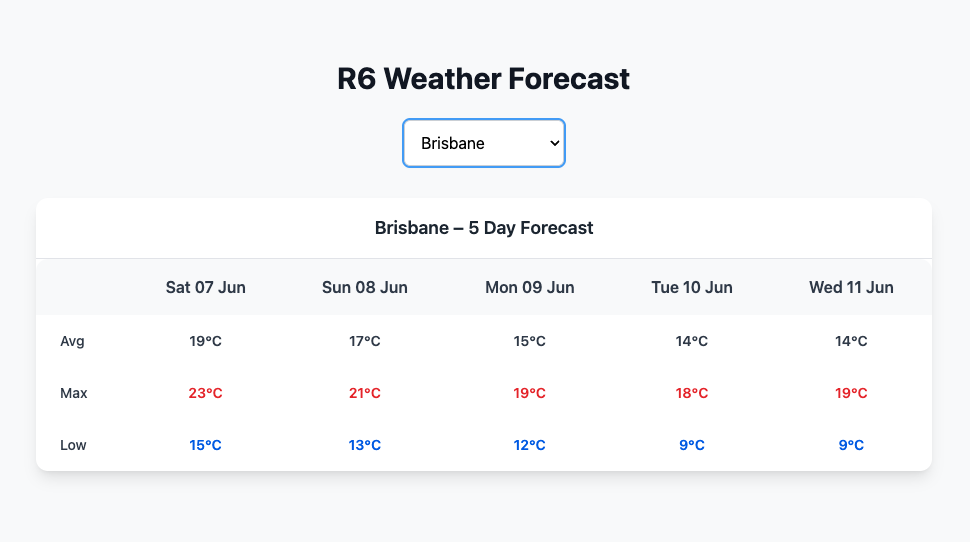

# 🌤 R6 Weather Forecast App

This is a full-stack weather forecast application built for the R6 coding challenge. It features:

- A **React + Tailwind CSS** frontend for city selection and 5-day weather visualization  
- A **Laravel** backend that interfaces with the [Weatherbit API](https://www.weatherbit.io/api/weather-forecast-16-day)  
- A **Console command tool** for CLI-based weather fetching  
- Graceful **error handling** and clean tabular UI  

---

## 📦 Requirements

- **PHP 8.1+** — for the Laravel backend
- **Composer** — to manage Laravel dependencies
- **Node.js 16+** — required for React + Vite + Tailwind CSS frontend
- **npm** — for installing frontend packages (or yarn, if preferred)
- A free **[Weatherbit API key](https://www.weatherbit.io/)** — required to fetch real forecast data


---

## 📁 Project Structure

```bash
r6-weather-app/
├── backend/          # Laravel API + CLI app
│   └── routes/api.php
│   └── app/Console/Commands/ForecastCommand.php
│   └── app/Http/Controllers/ForecastController.php
├── frontend/         # React + Tailwind frontend
│   └── src/App.jsx
│   └── index.css
└── README.md
```

---

## 🚀 Setup Instructions

### 1. Backend (Laravel API)

```bash
cd backend

# Install dependencies
composer install

# Set up environment
cp .env.example .env
php artisan key:generate

# Add your API key
echo "WEATHERBIT_API_KEY=your_key_here" >> .env

# Start local server
php artisan serve
```

**API Endpoint:**
```http
GET /api/forecast?city=Brisbane
```

---

### 2. Frontend (React App)

```bash
cd ../frontend

# Install frontend dependencies
npm install

# Note: API endpoint is hardcoded to http://127.0.0.1:8000 in App.jsx.
# You can optionally refactor it to use VITE_API_BASE if needed.

# Start development server
npm run dev
```

Open [http://localhost:5173](http://localhost:5173) to use the app.

---

### 3. CLI Forecast Tool (Bonus)

```bash
# Example: single or multiple cities
php artisan forecast Brisbane
php artisan forecast Brisbane "Gold Coast"

# Interactive (no argument)
php artisan forecast
```

---

## ✅ Error Handling

- ❌ Missing city param → 400 Bad Request  
- ❌ Invalid city name → 404 with message  
- ❌ API key or service failure → 500 Internal Server Error  
- ✅ All errors return meaningful JSON and log entries  

---

## 🧠 Assumptions & Design Decisions

- Weather is always queried in **Australia (`country=AU`)**
- Forecast is simplified to `avg`, `max`, and `low` over 5 days
- No authentication or database layer is required for this demo
- Console and Web layers are completely decoupled
- Tailwind CSS is used for speed and responsiveness
- City list is static for now but can be API-driven later

---

## 📷 UI Preview



---

